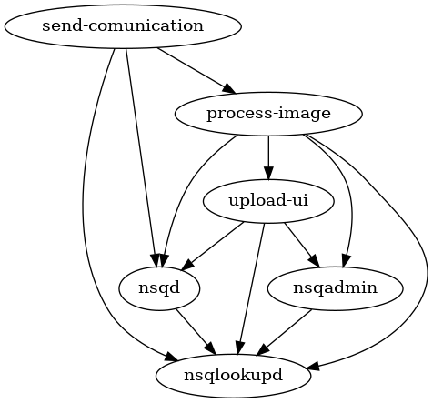

# Docker Compose Dependency Graph Generator

This tool generates a DOT file for a service found in a *docker-compose.yml* file. These DOT files can then be fed into GraphViz to generate a graph.



## Example

```bash
go run . -in="./docker-compose.yml" -service="your-service-name"
```

This will produce output that looks like this.

```
digraph G {
	"send-comunication" -> "nsqd"
	"nsqd" -> "nsqlookupd"
	"send-comunication" -> "nsqlookupd"
	"send-comunication" -> "process-image"
	"process-image" -> "nsqd"
	"process-image" -> "nsqlookupd"
	"process-image" -> "nsqadmin"
	"nsqadmin" -> "nsqlookupd"
	"process-image" -> "upload-ui"
	"upload-ui" -> "nsqd"
	"upload-ui" -> "nsqlookupd"
	"upload-ui" -> "nsqadmin"
}
```

Then if you wish you can use the GraphViz executable to create a graphic. For example:

```bash
go run . -in="./docker-compose.yml" -service="your-service-name" > input.dot
dot -Tpng input.dot -o output.png
```

Or string it together like so.

```bash
go run . -in="./docker-compose.yml" -service="your-service-name" | dot -Tpng -o output.png
```

